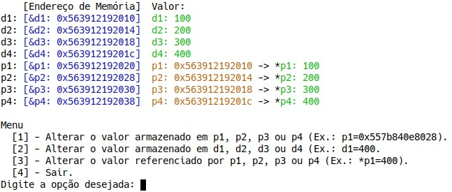
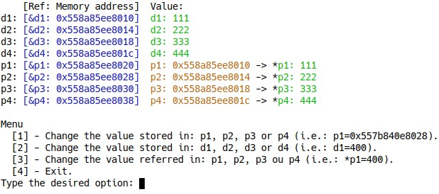

## Ponteiros em C (Português)
(For the English version, see below)

Entender como ponteiros funcionam e são manipulados costuma ser um problema para alunos que começam a estudar programação.

Devido a isso, criei um  programa para exemplificar melhor o que ocorre na memória do computador e como ocorre a manipulação de ponteiros em C.

O programa foi criado no GNU/Linux e possui cores para melhor apresentar o conteúdo. Por isso, recomendo utilizar o GNU/Linux.

Baixe o programa e o compile com o código:
```sh
$ git clone https://github.com/jeiks/pointers.git
$ cd pointers/pt_BR
$ gcc ponteiros.c -o ponteiros.e
```

E o execute com o comando:
```c
$ ./ponteiros.e
```
O programa demonstrará uma tela semelhante a essa tela, mas com os endereços de memória diferentes:



Onde:

-   A primeira coluna apresenta a variável;
-   A segunda coluna apresenta o endereço da memória da variável;
-   A terceira coluna apresenta o valor que está armazenado dentro da variável;
-   A quarta coluna, presente somente nos ponteiros, que representa o valor referenciado pelo ponteiro (*p1, *p2, *p3 e *p4).

Após isso, utilize o menu para modificar os valores de todas as variáveis, incluindo os endereços que os ponteiros estão armazenado.

Divirtam-se.

## Pointers in C (English)

A challenge for many students starting to program is understanding pointers and how they are manipulated.

Seeking to facilitate this process, I created a program to better exemplify what happens in computer memory and how pointer manipulation occurs in C.

The program was created in GNU/Linux and has colors to better present its content. So I recommend you to use it on GNU/Linux.

Download and compile the program using the following commands:
```sh
$ git clone https://github.com/jeiks/pointers.git
$ cd pointers/us
$ gcc pointers.c -o pointers.e
```

And run it with the command:
``` c
$ ./pointers.e
```
The program will show a screen similar to this one, but with different memory addresses:



Where:

- The first column presents the variable;
- The second column displays the variable's memory address;
- The third column shows the value that is stored inside the variable;
- The fourth column, visible only to pointers, represents the value referenced by the pointer (*p1, *p2, *p3 and *p4).

After that, use the menu to modify the values of all variables, including the addresses that the pointers are storing.

Have fun!

